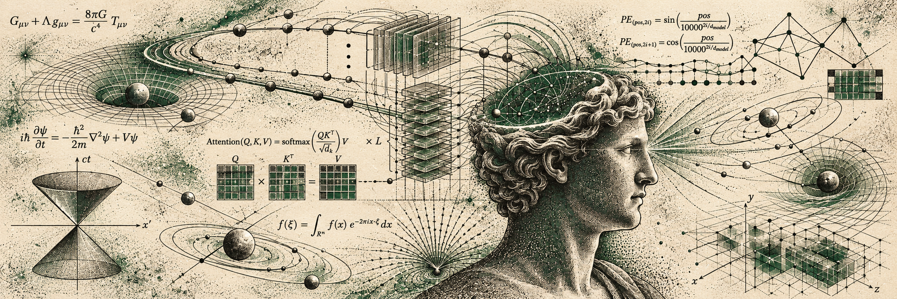
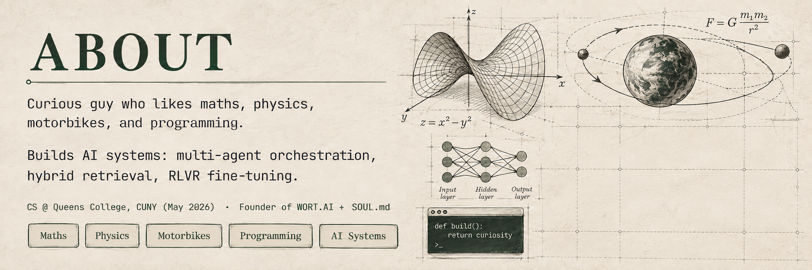
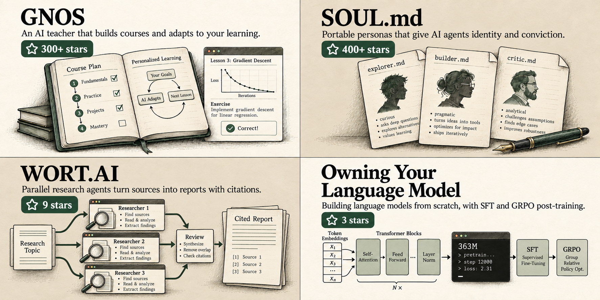

<!-- ════════════════  HERO ════════════════ -->

 

<!-- Science and AI illustration -->

 

 

<!-- socials — original brand colors -->

  

<!-- vitals -->

## Featured Projects

## Experience

&nbsp;

&nbsp;

---

## GitHub Activity

&nbsp;

<!-- contribution snake — red accent, loaded locally -->

<picture>
  <source media="(prefers-color-scheme: dark)" srcset="https://raw.githubusercontent.com/madhvantyagi/madhvantyagi/output/github-snake-dark.svg" />
  <source media="(prefers-color-scheme: light)" srcset="https://raw.githubusercontent.com/madhvantyagi/madhvantyagi/output/github-snake-dark.svg" />
  
</picture>

 

